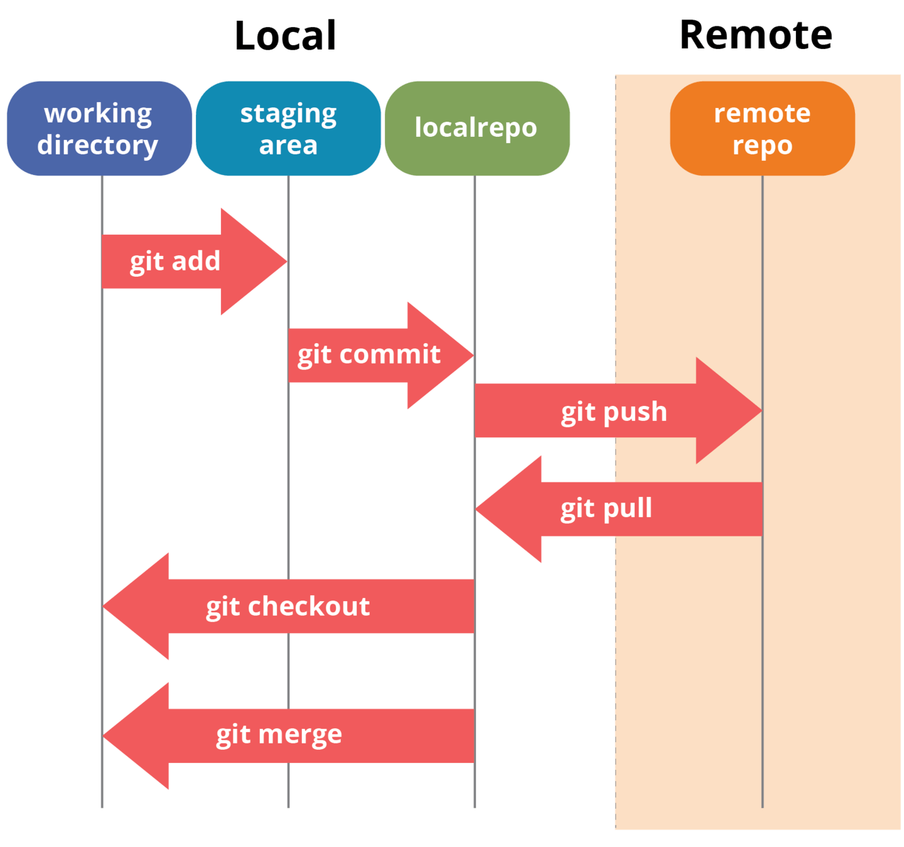

---
# You can also start simply with 'default'
theme: seriph
# random image from a curated Unsplash collection by Anthony
# like them? see https://unsplash.com/collections/94734566/slidev
background: https://cover.sli.dev
# some information about your slides (markdown enabled)
title: Seminario Git
info: |
  ## Slidev Starter Template
  Presentation slides for developers.

  Learn more at [Sli.dev](https://sli.dev)
# apply unocss classes to the current slide
class: text-center
# https://sli.dev/features/drawing
drawings:
  persist: false
# slide transition: https://sli.dev/guide/animations.html#slide-transitions
transition: slide-left
# enable MDC Syntax: https://sli.dev/features/mdc
mdc: true
---

# Git

Sesión de iniciación

  <button @click="$slidev.nav.openInEditor()" title="Open in Editor" class="text-xl slidev-icon-btn opacity-50 !border-none !hover:text-white">
    <carbon:edit />
  </button>
  <a href="https://github.com/slidevjs/slidev" target="_blank" alt="GitHub" title="Open in GitHub"
    class="text-xl slidev-icon-btn opacity-50 !border-none !hover:text-white">
    <carbon-logo-github />
  </a>

<!--
The last comment block of each slide will be treated as slide notes. It will be visible and editable in Presenter Mode along with the slide. [Read more in the docs](https://sli.dev/guide/syntax.html#notes)
-->
---
layout: two-cols
layoutClass: gap-16
---

# Índice

Temas que vamos a tratar en esta sesión

::right::

<Toc v-click minDepth="1" maxDepth="1"></Toc>
---
layout: image-right
image: https://cover.sli.dev
transition: slide-up
---

# ¿Qué es Git?

<!--
You can have `style` tag in markdown to override the style for the current page.
Learn more: https://sli.dev/features/slide-scope-style
-->

<!--
Here is another comment.
-->
---
transition: slide-up
level: 2
---

# ¿Qué es Git?

 
 

- Definición: Git es un sistema de control de versiones que registra cambios en archivos a lo largo del tiempo.
 
 
- Importancia:
  - Facilita la colaboración entre desarrolladores.
  - Permite realizar un seguimiento detallado de la evolución del código.
  - Facilita la reversión a versiones anteriores en caso de problemas.

 
 

¿Quieres saber más sobre Git?: [Curso online](https://learn.microsoft.com/es-es/training/paths/intro-to-vc-git/)

<!--
Here is another comment.
-->
---
transition: slide-up
level: 2
---

# Principales Características de Git

 
 

### Distribuido:
Cada colaborador tiene una copia completa del repositorio.

### Historial de cambios:
Registra cada modificación realizada en el proyecto.

### Branching:
Permite trabajar en ramas independientes para desarrollar nuevas características.

### Colaboración:
Posibilita la colaboración simultánea de múltiples desarrolladores.

<!--
Here is another comment.
-->

---
transition: slide-left
level: 2
---

# ¿Por qué es Crucial para el Desarrollo de Software?

 
 

### Colaboración eficiente:
Facilita el trabajo en equipo al gestionar de manera efectiva los cambios realizados por diferentes miembros del equipo.

### Seguimiento de cambios:
Proporciona un registro detallado de todas las modificaciones.

### Reversión sin problemas:
Permite regresar a versiones anteriores fácilmente en caso de problemas o errores.

<!--
Here is another comment.
-->

---
layout: image-right
image: https://cover.sli.dev
transition: slide-up
---

# Instalación de Git

---
transition: slide-up
level: 2
---

# Instalación de Git

## Linux:
- Op1: Utiliza el gestor de paquetes de tu distribución: ejemplo debian `sudo apt install git`
- Op2: Emplear un ide de los abajo mencionados
## Mac:
- Op1: Utiliza Homebrew: `brew install git`
- Op2: [Github Desktop](https://desktop.github.com/download/) 
## Windows:
- Op1: [Github Desktop](https://desktop.github.com/download/) 
- Op2: [Gitkraken](https://www.gitkraken.com/)
- Op3: Descarga el instalador desde [git-smc](git-scm.com) y sigue el asistente.
  - Emplear Git BASH como línea de comandos.

---
transition: slide-up
level: 2
---

# Configuración de la identidad

### Configura tu nombre de usuario:

`git config --global user.name "Tu Nombre"`

### Configura tu email:

`git config --global user.email "tu@email.com"`

### Verificación:
`git --version`

`git config --list`

o bien

`git config --global --get user.name`

`git config --global --get user.email`

---
transition: slide-up
level: 2
---

# Trabajar en un repositorio local

### Crear un repositorio local (situarse en carpeta de trabajo):

`git init`

### Analizar el directorio:

`ls -a`

### Realizar commits y explorar la historia:

`git add nombre_del_archivo`

`git commit -m "Mensaje descriptivo del commit"`

`git log`

---
transition: slide-left
level: 2
---

# Trabajar en un repositorio local

### Crear un fichero

`touch leeme.md`

### Analizar el directorio:
`ls -a`

### Analizar estado de repositorio:
`git status`

### Realizar commits y explorar la historia (git status tras cada comando):
`git add leeme.md`

`git commit -m "Añadido el fichero leeme.md"`

`git log --oneline`

---
layout: image-right
image: https://cover.sli.dev
transition: slide-up
---

# Conceptos básicos de Git

<!-- Inline style -->

<!--
Notes can also sync with clicks

[click] This will be highlighted after the first click

[click] Highlighted with `count = ref(0)`

[click:3] Last click (skip two clicks)
-->

---
transition: slide-left
level: 2
transition: slide-up
---

# Ciclo de Vida de Archivos en Git

### Untracked
Archivos nuevos no rastreados.

### Tracked
Archivos bajo seguimiento de Git.

### Staged
Archivos preparados para el próximo commit.

### Committed
Archivos almacenados de manera permanente.

---
layout: two-cols
image: /imagen/Ciclo.png
transition: slide-left
level: 2
---

# Repositorios: Local vs. Remoto

  

::right::

 
 
 
 

### Repositorio Local:
- Almacenamiento en tu máquina.
- git init para iniciar uno.

 
 

### Repositorio Remoto:
- Almacenamiento en un servidor.
- Facilita la colaboración entre equipos.
- Ej: Github, Gitlab, Bitbucket, etc.

---
layout: image-right
image: https://cover.sli.dev
transition: slide-up
---

# Git Branching

---
transition: slide-up
level: 2
---

# Branch

- Ramificaciones independientes en las que se pueden trabajar sin afectar el código principal.
- Se puede trabajar en diversas ramas de forma simultanea.
  - BugFixes.
  - Nuevas características.
- Las ramas habitualmente se fusionan merge con la rama principal.

---
transition: slide-up
level: 2
---

# Commits, Branches y Merges

### Commits:
Instantáneas de cambios.

`git commit -m "Mensaje"`

### Branches:
Ramificaciones independientes.

`git branch nombre_rama`

### Merges:
Combinar cambios de ramas.

`git merge nombre_rama`

---
transition: slide-left
level: 2
---

# Visualizadores online:

 
 

- https://git-school.github.io/visualizing-git/

 
 

- https://learngitbranching.js.org

  - Ir a "Secuencia introductoria: apartado 3"

---
layout: image-right
image: https://cover.sli.dev
transition: slide-up
---

# Git en GNATStudio

---
transition: slide-left
level: 2
---

# Configuración GNATStudio

- git init en la carpeta del proyecto.
- Project properties: Version Control
  - System: git
  - Path: carpeta del proyecto
- Crear fichero .gitignore
  - Añadir carpeta obj/
- Comenzar a trabajar.

---
layout: image-right
image: https://cover.sli.dev
transition: slide-up
---

# Git en GNATStudio + Github
## (o alternativas)

---
transition: slide-up
level: 2
---

# Github - GNATStudio

- Crear repositorio en remoto (github)
- En local 2 opciones:
  - OP1: Clonar el repositorio vacío y configurar GNATStudio.
  - OP2: Configurar GNATStudio y sincronizar con el repositorio remoto
- Comenzar a trabajar.

---
transition: slide-up
level: 2
---

# Opción 1: Github - GNATStudio

- git clone https://github.com/usuario/repo.git
- Configurar GNATStudio

---
transition: slide-up
level: 2
---

# Github - GNATStudio

- Configurar GNATStudio

`git remote add origin git@github.com:usuario/repo.git`

`git push -u origin master`

---
transition: slide-left
layout: end
class: text-center
---

# FIN
